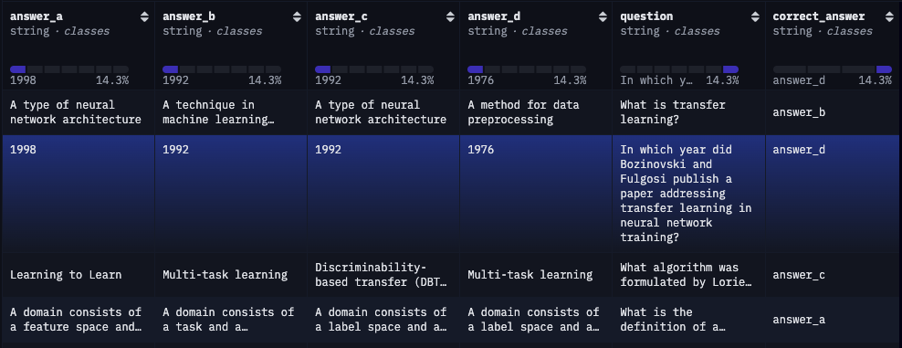

# Đánh Giá Theo Lĩnh Vực Cụ Thể với Argilla, Distilabel, và LightEval

Hầu hết các bộ tiêu chuẩn (`benchmark`) phổ biến đều xem xét các khả năng rất chung chung (lý luận, toán học, lập trình), nhưng bạn đã bao giờ cần nghiên cứu các khả năng cụ thể hơn chưa?

Bạn nên làm gì nếu bạn cần đánh giá một mô hình trên một **lĩnh vực cụ thể** liên quan đến các trường hợp sử dụng của bạn? (Ví dụ: các trường hợp sử dụng tài chính, pháp lý, y tế)

Hướng dẫn này chỉ cho bạn toàn bộ quy trình (`pipeline`) mà bạn có thể làm theo, từ việc tạo dữ liệu liên quan và chú thích các mẫu của bạn đến việc đánh giá mô hình của bạn trên chúng, với các công cụ dễ sử dụng [Argilla](https://github.com/argilla-io/argilla), [distilabel](https://github.com/argilla-io/distilabel), và [lighteval](https://github.com/huggingface/lighteval). Trong ví dụ của chúng tôi, chúng tôi sẽ tập trung vào việc tạo các câu hỏi đánh giá từ nhiều tài liệu.

## Cấu trúc dự án

Đối với quy trình của chúng tôi, chúng tôi sẽ làm theo 4 bước, với một tập lệnh cho mỗi bước: tạo tập dữ liệu, chú thích nó, trích xuất các mẫu liên quan để đánh giá từ nó và thực sự đánh giá các mô hình.

| Tên tập lệnh | Mô tả |
|-------------|-------------|
| generate_dataset.py | Tạo các câu hỏi đánh giá từ nhiều tài liệu văn bản bằng cách sử dụng một mô hình ngôn ngữ được chỉ định. |
| annotate_dataset.py | Tạo tập dữ liệu Argilla để chú thích thủ công các câu hỏi đánh giá được tạo. |
| create_dataset.py | Xử lý dữ liệu đã chú thích từ Argilla và tạo tập dữ liệu Hugging Face. |
| evaluation_task.py | Định nghĩa một tác vụ LightEval tùy chỉnh để đánh giá các mô hình ngôn ngữ trên tập dữ liệu câu hỏi đánh giá. |

## Các bước thực hành

### 1. Tạo tập dữ liệu

Tập lệnh `generate_dataset.py` sử dụng thư viện `distilabel` để tạo các câu hỏi thi dựa trên nhiều tài liệu văn bản. Nó sử dụng mô hình được chỉ định (mặc định: Meta-Llama-3.1-8B-Instruct) để tạo các câu hỏi, câu trả lời đúng và câu trả lời sai (được gọi là câu gây nhiễu). Bạn nên thêm các mẫu dữ liệu của riêng bạn và bạn có thể muốn sử dụng một mô hình khác.

Để chạy quá trình tạo:

```sh
python generate_dataset.py --input_dir path/to/your/documents --model_id your_model_id --output_path output_directory
```

Thao tác này sẽ tạo một [Distiset](https://distilabel.argilla.io/dev/sections/how_to_guides/advanced/distiset/) chứa các câu hỏi thi được tạo cho tất cả các tài liệu trong thư mục đầu vào.

### 2. Chú thích tập dữ liệu

Tập lệnh `annotate_dataset.py` lấy các câu hỏi đã tạo và tạo tập dữ liệu Argilla để chú thích. Nó thiết lập cấu trúc tập dữ liệu và điền vào đó các câu hỏi và câu trả lời đã tạo, sắp xếp ngẫu nhiên thứ tự các câu trả lời để tránh sai lệch. Khi ở trong Argilla, bạn hoặc một chuyên gia trong lĩnh vực có thể xác thực tập dữ liệu với các câu trả lời đúng.

Bạn sẽ thấy các câu trả lời đúng được đề xuất từ `LLM` theo thứ tự ngẫu nhiên và bạn có thể phê duyệt câu trả lời đúng hoặc chọn một câu trả lời khác. Thời gian của quá trình này sẽ phụ thuộc vào quy mô của tập dữ liệu đánh giá của bạn, độ phức tạp của dữ liệu lĩnh vực của bạn và chất lượng của `LLM` của bạn. Ví dụ: chúng tôi đã có thể tạo 150 mẫu trong vòng 1 giờ trên lĩnh vực chuyển giao học tập (`transfer learning`), sử dụng Llama-3.1-70B-Instruct, chủ yếu bằng cách phê duyệt câu trả lời đúng và loại bỏ những câu trả lời không chính xác.

Để chạy quá trình chú thích:

```sh
python annotate_dataset.py --dataset_path path/to/distiset --output_dataset_name argilla_dataset_name
```

Thao tác này sẽ tạo một tập dữ liệu Argilla có thể được sử dụng để xem xét và chú thích thủ công.


Nếu bạn không sử dụng Argilla, hãy triển khai cục bộ hoặc trên không gian (`spaces`) theo [hướng dẫn bắt đầu nhanh](https://docs.argilla.io/latest/getting_started/quickstart/) này.

### 3. Tạo tập dữ liệu

Tập lệnh `create_dataset.py` xử lý dữ liệu đã chú thích từ Argilla và tạo tập dữ liệu Hugging Face. Nó xử lý cả các câu trả lời được đề xuất và được chú thích thủ công. Tập lệnh sẽ tạo một tập dữ liệu với câu hỏi, các câu trả lời có thể và tên cột cho câu trả lời đúng. Để tạo tập dữ liệu cuối cùng:

```sh
huggingface_hub login
python create_dataset.py --dataset_path argilla_dataset_name --dataset_repo_id your_hf_repo_id
```

Thao tác này sẽ đẩy tập dữ liệu lên Hugging Face Hub dưới kho lưu trữ được chỉ định. Bạn có thể xem tập dữ liệu mẫu trên `hub` [tại đây](https://huggingface.co/datasets/burtenshaw/exam_questions/viewer/default/train) và bản xem trước của tập dữ liệu trông như thế này:



### 4. Tác vụ đánh giá

Tập lệnh `evaluation_task.py` định nghĩa một tác vụ LightEval tùy chỉnh để đánh giá các mô hình ngôn ngữ trên tập dữ liệu câu hỏi thi. Nó bao gồm một hàm nhắc nhở (`prompt function`), một chỉ số chính xác tùy chỉnh và cấu hình tác vụ.

Để đánh giá một mô hình bằng `lighteval` với tác vụ câu hỏi thi tùy chỉnh:

```sh
lighteval accelerate \
    --model_args "pretrained=HuggingFaceH4/zephyr-7b-beta" \
    --tasks "community|exam_questions|0|0" \
    --custom_tasks domain-eval/evaluation_task.py \
    --output_dir "./evals"
```

Bạn có thể tìm thấy các hướng dẫn chi tiết trong `lighteval wiki` về từng bước sau:

- [Tạo tác vụ tùy chỉnh](https://github.com/huggingface/lighteval/wiki/Adding-a-Custom-Task)
- [Tạo chỉ số tùy chỉnh](https://github.com/huggingface/lighteval/wiki/Adding-a-New-Metric)
- [Sử dụng các chỉ số hiện có](https://github.com/huggingface/lighteval/wiki/Metric-List)